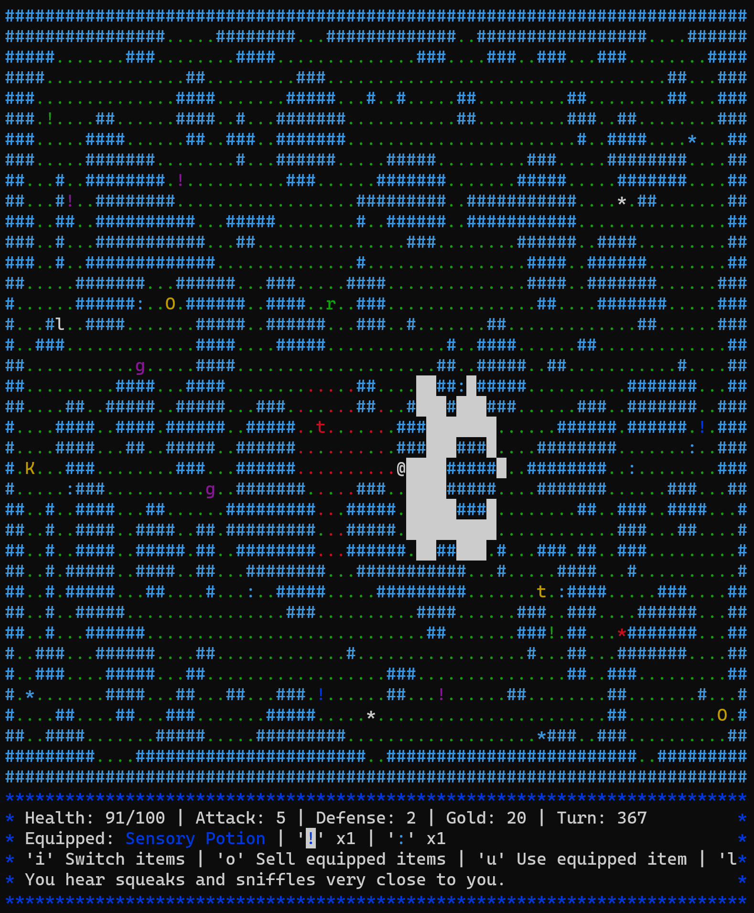

[](https://github.com/migueltc13/project-li2/actions/workflows/makefile.yml)
[](https://github.com/migueltc13/project-li2/actions/workflows/static.yml)

# Roguelite

Project description at [projeto.pdf](extra/projeto.pdf).

## Requirements
  - [ncurses](#install-ncurses)

## Install ncurses

Install ncurses using apt with:

```sh
sudo apt install libncurses5-dev libncursesw5-dev
```

More on [ncurses](https://en.wikipedia.org/wiki/Ncurses).

## Tools

Install all tools used in the development of this game with:

```sh
make install
```

- [gdb](https://www.sourceware.org/gdb/): Debugger
- [Valgrind](https://valgrind.org/): Memory management tool 
- [Doxygen](https://www.doxygen.nl/): Documentation generator

## Play

```sh
make
./play
```




## Documentation

Doxygen documentation at [migueltc13.github.io/project-li2/](https://migueltc13.github.io/project-li2/).

## Author

- [Miguel Carvalho](https://github.com/migueltc13)

**Final grade:** 18
